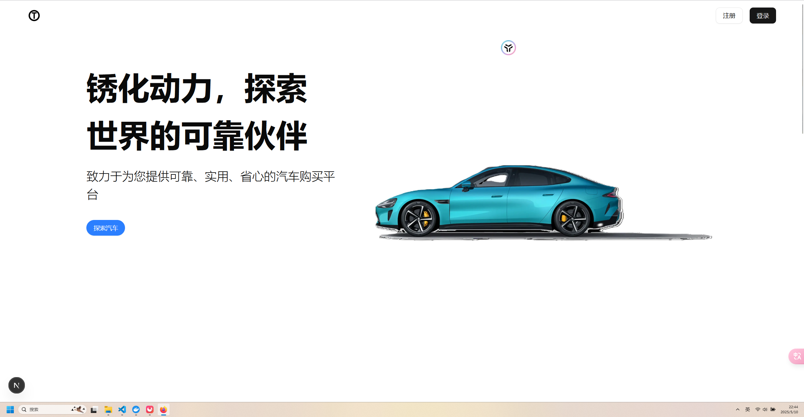

# 锈化动力商城前端

首先启动服务

```bash
npm run dev
# or
yarn dev
# or
pnpm dev
# or
bun dev
```

打开 [http://localhost:3000](http://localhost:3000) 查看结果

## 功能

* RBAC WITH DOMAIN鉴权
* 实时配置切换、实时配置算费
* SSR


## Preview




## 常用快捷键

- rfc：函数组件（无状态）
- rafce：箭头函数组件
- rmc：用memo包裹的高阶组件（记忆化渲染）

## 本项目强制使用服务端渲染
